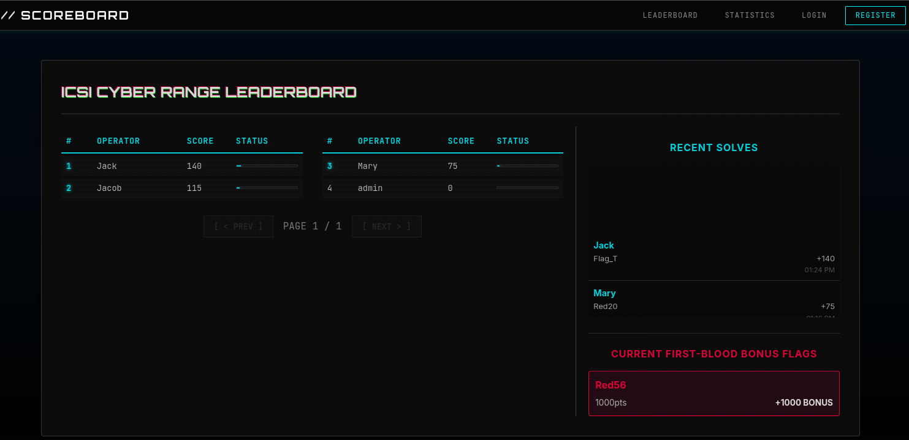

# iCSI Cyber Range CTF Scoreboard



A dynamic, CRT-styled CTF scoreboard built with Node.js, Express, and SQLite. Features real-time score tracking, "First Blood" bonuses, and a retro aesthetic.

## Features
- **Dynamic Leaderboard**: Tracks operator scores in real-time.
- **Rotating Stats**: Automatically cycles through "Most Solves Today", "This Week", and "This Month" on the main display.
- **Retro Aesthetic**: CRT scanlines, glitched text effects, and neon styling.
- **First Blood System**: Bonuses for being the first to solve a challenge.
- **Ticker**: Live feed of recent solves.

## Deployment

### Docker (Recommended)

The easiest way to run the scoreboard is using Docker.

**Using Docker Compose:**
```bash
# Start the container
docker compose up -d --build
```

**Using Docker Run:**
```bash
# Pull the latest image
docker pull joshbeck2024/ctf-cyberlessons-flag-scoreboard-public:latest

# Run on port 4005
docker run -d -p 4005:4005 --name scoreboard joshbeck2024/ctf-cyberlessons-flag-scoreboard-public:latest
```

The scoreboard will be available at `http://localhost:4005`.

## Development
1. Clone the repository.
2. Install dependencies: `npm install`
3. Run locally: `node src/server.js`

## Configuration
- **Port**: Defaults to `4005` (configured in `docker-compose.yml` or `ENV`).
- **Data**: Database is stored in `./data/scoreboard.db`. This volume is persisted in the Docker Compose configuration.

## Credits
Built for the iCSI Cyber Range.
